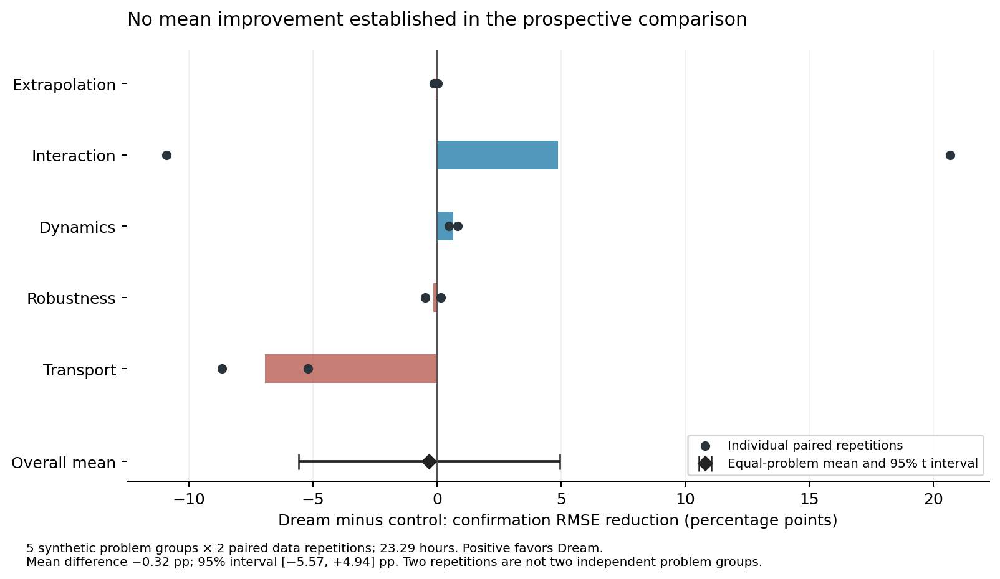

# Dream-RSI 前瞻长测：结果与研究能力

状态：完成。正式研究与确认评估历时 **23.29 小时**，全部 10 组配对及 30 次确认程序执行已结束，完整核验通过。

## 均值判断与默认

旧策略平均收益 **54.95%**，Dream 第 4 版 **54.64%**，差值 **−0.32 个百分点**。收益指相对共同基线的确认集 RMSE 降低比例，不是任务成功率。

| 问题（每题两次重复） | 旧策略 | Dream 第 4 版 | 差值（百分点） |
|---|---:|---:|---:|
| 外推 | 89.05% | 89.01% | -0.05 |
| 交互机制 | 60.36% | 65.24% | +4.88 |
| 动态系统 | 55.43% | 56.09% | +0.66 |
| 噪声与异常值 | 20.07% | 19.91% | -0.16 |
| 环境迁移 | 49.86% | 42.94% | -6.92 |
| **五题等权平均** | **54.95%** | **54.64%** | **−0.32** |

五个问题层面的均值差 95% t 区间为 **[−5.57, +4.94] 个百分点**；32 种问题符号翻转的双侧参考 p 值为 **0.8125**。两种方法谁的总体期望更高，现有证据仍不精确。不能宣称 Dream 提升了平均研究能力，也不能把这轮结果解释成它普遍更差。

按用户“默认选均值更高者”的准则，Core `run_online` 与 Pro `run_discovery` 无显式策略／开发池时恢复 **ParallelRefine**。分支独立历史、诊断实验、完整失败反馈接口、可编程策略和训练／验证回放均保留；显式新策略与策略学习入口仍可用。既有单一全局研究上下文的 daemon 没有自动迁移。

本次在线 Dream 源码身份为 `cc2d8eb36d9bc27c1e325898998ce806bf21c3151159e8007b1f19638d99b967`，源码 SHA-256 为 `0cc6efd4d684697ce690c8be4712ac4912520f13f6f04230426454a5d6f6a3da`。它是训练／验证选出的第 4 版，**不是**之前设为默认的 Portfolio 引导实现。原样源码与默认决策随证据发布；新策略未被包装成已经胜出的默认。

## 需要回答的问题

1. 在相同在线尝试数下，新探索策略能否提高最终方法的平均泛化收益？
2. 系统有没有执行“提出解释—设计区分实验—观察结果—修改方法”的研究过程？
3. 哪些收益属于共享研究执行能力，哪些能归因于新策略分配探索机会？

这三个问题分别看结果、实际研究轨迹和配对差异，不能用其中一项替代其余两项。

## 实验口径

- 五类合成预测问题：外推、交互机制、动态系统、噪声与异常值、环境迁移；每类两次数据重复。
- 每次重复中，两种策略各有 14 次在线尝试，共 20 个策略运行、10 组配对。
- 两种策略使用相同研究模型、开放方法提示、执行环境和分支上下文规则。旧策略均匀分配探索深度；新策略使用开发阶段选出的程序化分配规则。因此，本次前瞻对照主要检验探索机会的分配。
- 每个程序可自行设计表示、估计方法和诊断实验。它在受限容器执行，评价行只提供特征；分析程序可以读取开发集标签。
- 所有最终方法先共同冻结，再运行独立确认集。指标为 `1 − 方法确认集 RMSE / 基线确认集 RMSE`，越高越好。先平均同一问题的两次重复，再对五个问题等权平均。
- 不可用的确认结果按预定规则记为收益 −1。格式错误、运行错误、服务错误和截断均保留，既不删除也不重试。
- 新策略开发额外用了 96 次完整树采样和 4 次策略提案。在线尝试数相同，不等于端到端总调用数、墙钟时间或程序内部模型拟合次数相同。

逐次配对、逐问题均值、区间及失败均已发布。共同基线是在开发集上从 Ridge、HGB、RBF 核岭回归中选出的最佳者。每题训练 360 行、开发 240 行、确认 600 行。固定模型 claude-opus-5 / high，每次最多 32768 输出 token；每题重复 0 先旧后新、重复 1 先新后旧。五个合成问题与同一个研究模型不足以证明广泛真实研究任务上的优势。

## 已执行的研究过程证据

### 交互机制：改变模型表达方式

新策略第二次交互问题的一条分支先诊断结构，然后依次引入筛选的乘积特征、分组加性核、组内交互坐标和区间指示坐标。其开发集 RMSE 从 0.3587 降至 0.1451。这是连续改变问题表示的实际执行轨迹，超出了固定参数表搜索。

内部比较同时改变了部分优化设置，不能把全部改善归因于单一坐标修改。旧策略也探索了区间结构；第一组交互问题开发集成绩反而是旧策略更好。两组都必须保留。

证据：`audit-notes/interaction-second-research-process.json`。

### 动态系统：比较相互竞争的结构解释

两种策略均比较了共享一种非线性输入形状与共享两种形状等结构，并实际运行了相关模型。保存的诊断和预测结果支持两种形状优于一种形状。这与隐藏生成机制在定性上相符，但不能据此声称识别出了唯一物理规律。

这个案例说明共享研究模型与执行协议支持可检验的结构假设；它不是 Dream 策略独有能力的证据。内部交叉验证报告没有重新执行，也不替代独立确认集。

证据：`audit-notes/dynamics-mechanism-comparison.json`。

### 环境迁移：从失败假设转向无标签校准

旧策略首轮的一条分支最初采用跨环境稳定的线性/特征子集方法，开发集 RMSE 为 0.4524，差于基线的 0.3207。下一步根据实际历史提出：某个变化特征可能是目标的带环境增益的测量；随后实现了只用新环境特征进行校准的方法，开发集 RMSE 降至 0.1570。

程序实际比较了同一基础预测器在训练环境留出评估中的校准开启/关闭结果。后续提示确实包含此前完整提案及测量反馈；方法没有获得新环境标签。但基础模型和特征也发生变化，不能把外部成绩变化全部归因于校准；这些检查也没有唯一确定因果图。

这是控制组中的研究修正，支持共享系统能够提出并执行新的机制假设，不能算作 Dream 分配策略的独有优势。

证据：`audit-notes/transport-first-mechanism-revision.json`。

## 解释研究行为时的教训

- **先确认研究者看到了什么，再判断它是否根据证据修正。** 噪声问题的一次校准实验出现负面内部结果，但该分支已用完分配机会，没有下一步研究者读到这些结果。此前将其解释为“忽视反证”是不成立的；原提案实际上预先写明了负面结果的含义。
- **测量反馈可以有价值，即使当前步骤没有更好预测。** 分支是否还有机会消费反馈，是探索分配的一部分；不能仅凭当步分数给诊断价值下结论。
- **研究能力需要执行证据。** 假设文字、代码、执行输出和下一步上下文必须对应；漂亮的解释本身不能证明做过实验。
- **能力证据与策略优势分别核验。** 两组都能做结构诊断时，不能把共同能力归功于某一分配策略。
- **失败反馈要保留真实原因。** 本轮执行适配器把输出截断和服务错误变成了空文本 JSON 解析错误，随后 Core 原样传递了这份不完整反馈。已核对实际后续请求。应在执行适配器处转交服务端的失败类型，使研究者能区分输出限制、网络服务问题与科学代码错误；不能把问题误归因于 Core 丢失历史，也不能声称这一尚未对照测试的修正已经提高了均值。
- **最终默认必须对应实际测试的代码。** 本轮新策略是开发阶段选出的第 4 版；原来的 Portfolio 引导策略不是同一个策略。已明确保存测试身份，并据前瞻均值恢复实际控制策略。不能借用一个策略的成绩宣传另一个默认实现。

修正记录：`audit-notes/robust-calibration-decision-gap.json`。

失败反馈核验：`audit-notes/provider-feedback-loss.json`。本轮冻结执行器未修改。

## 研究效率、失败与费用

| 阶段 | 模型调用 | 有效方法 / 有效诊断 / 科学尝试失败 | 平均每次在线运行 | 已知用量估算 |
|---|---:|---|---:|---:|
| 旧策略在线 | 140 | 108 / 18 / 14 | 47.73 分钟 | $62.69401 + 4 次未知用量 |
| Dream 在线 | 140 | 103 / 21 / 16 | 55.46 分钟 | $74.694795 |
| 策略开发 | 100 | 81 / 9 / 6，另 4 次策略提案 | 共 5.92 小时 | $50.995525 |

Dream 在线平均慢约 **16.2%**，未提高本轮主指标；因此不能声称研究效率已提升。程序内部拟合次数不相等，本研究没有估计等墙钟或等 GPU 预算的反事实收益。真正有效的简化是采用当前均值更高的简单默认，保留能产生新假设的共享执行能力。

376 次正式科学尝试中有 **36 次失败**：17 次提案格式／解析、1 次科学程序运行、14 次输出截断、4 次 HTTP 529。14 次截断分布为 Dream 11、旧策略 3；原始服务端 wire 文本未保存，只能确认本地终态报告为截断且提取文本为空，不能由此断言内部机制。所有失败消耗既定尝试，未补跑或事后修复成绩。

4 次 HTTP 529 影响旧策略的动态系统重复 0 与环境迁移重复 0。事后假设性敏感性情景把这两个唯一受影响运行的收益各设为完美预测的 1，旧策略均值为 **63.89%**、Dream 仍为 **54.64%**、差值 **−9.26 个百分点**。这只是偏向修复控制组的压力情景，不是观测结果、因果修复估计、形式化界限或主分析替代。格式和截断失败没有被假设修复。三次动态系统服务错误后仅父调度进程暂停约 157.47 秒；当时已有子调用继续执行，没有重试或更改科学代码。

正式 380 次模型调用，另有 3 次已关闭预检调用；本轮已知用量估算 **$189.199615**，4 次服务错误费用未知、保留上界 **$5.91525**。包括本轮在内的历史累计已知估算 **$355.593367**，累计 **25 次未知费用记录**仍有覆盖。累计保守预留 **$4988.4727 / $5000**。这些是用量估算和预留，不是账单。预算证明、每次调用上界、子进程与容器关闭记录均通过核验。

## 下一轮研究重点

1. **先把测量结果变成可用的研究反馈。** 执行适配器应保留真实的服务失败原因；成功诊断应让后续研究者看见并说明如何改变假设。此次发现的是实际信息缺口，修正的均值效果尚未测试。
2. **直接比较证据如何改变方法。** 下一轮先冻结一个小而明确的研究协议改动，例如要求提出相互竞争的解释、执行能区分它们的实验，再依据结果继续。仍允许自由发明方法，不设固定算法菜单。对照共享模型与执行器，以新问题的独立确认质量为主指标，报告完整耗时；不能用“写了假设”或事后挑出的成功轨迹代替收益。
3. **研究分配策略要看实际失败模式。** 环境迁移两次新策略都退步、交互机制两次差异方向相反，值得提出可证伪的解释。现有五题已用于默认决策与分析，下一版应使用新的问题／数据，不能继续针对已公布结果选默认并当成独立验证。

本次交付只恢复默认并固化证据，没有启动新的付费研究，也没有将上述未测试修改混入本轮结果。

## 复核入口

- [公开确认预测、汇总、原样策略和复算脚本](../evidence/dream-rsi-long-20260919/README.md)：可独立重算 600 行 × 10 组配对的 RMSE、问题等权均值、区间与符号翻转值。
- [逐次配对及主汇总](../evidence/dream-rsi-long-20260919/summary.json)、[运行与用量汇总](../evidence/dream-rsi-long-20260919/operational-summary.json)、[默认决策](../evidence/dream-rsi-long-20260919/default-decision.json)。
- 完整原始输入、提案、逐步上下文、执行输出、冻结运行时、预算证明及审计记录存于 Pro 同名证据目录；公开复算只检查数值计算，完整私有核验还检查来源绑定及标签隔离。

45 项相关 Core/Pro 检查通过，包括恢复后的默认分配、两入口一致性，以及显式策略开发后确实用于下一轮执行。

原始核验与解压后独立、无网络、只读环境的完整核验均通过。后者使用冻结源码，核对 11 个运行时源码哈希、62 个预算证明、24 个世界与 30 份确认预测；没有重跑模型或科学方法。复核调度轨迹须使用原调度环境 Python 3.10（numpy 2.2.6 / scipy 1.15.3）；科学方法容器使用 Python 3.12。跨版本费用浮点求和的微小差异会触发原有严格轨迹相等检查，相关诊断与失败日志已保留。
